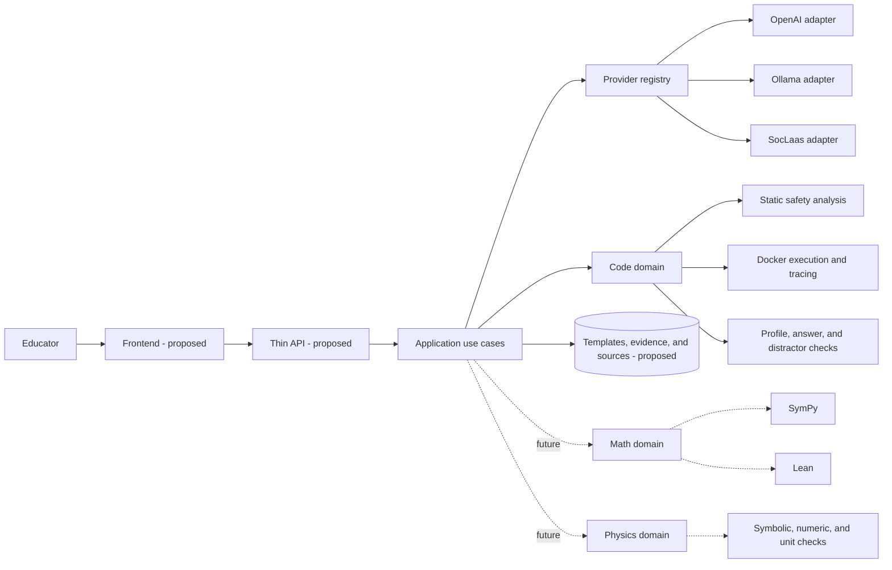

# EdCraft: Tool-Validated, Reusable Question Generation

## Initial project proposal

## 1. Executive summary

EdCraft is a proposed educational question-generation system that uses a large
language model (LLM) to author a reusable question template instead of generating
every question independently. Domain-specific tools validate the template once,
after which many question instances can be produced locally and deterministically
without further LLM calls.

The first domain is Python code-tracing multiple-choice questions. An initial
working prototype already supports five programming topics at three difficulty
levels, multiple model providers, isolated Docker execution, exhaustive validation
over finite parameter sets, structured validation evidence, and reproducible
question generation from a seed.

The project will build on this baseline to investigate stronger measures of
question quality, source grounding from user-provided documents, educator review,
and future mathematics and physics modules.

The central design principle is:

> AI proposes; deterministic tools validate; educators decide; approved templates
> generate.

## 2. Problem and motivation

Generating every question directly with an LLM has three practical weaknesses:

- Each additional question requires another inference, increasing cost and latency.
- Outputs can vary in structure, correctness, and quality between calls and models.
- Each concrete question and answer must be checked independently.

EdCraft moves the LLM call to template authoring. A model might create a Python
program parameterized by `n`, together with the answer rule `n` for the number of
loop-body iterations. The system validates every allowed value of `n` once. An
approved template can then produce different questions by selecting parameter
values with a deterministic seed.

This approach amortizes generation and validation cost across many questions. It
also separates creative generation from correctness: the model is treated as an
untrusted proposer, while explicit tools determine whether its output is usable.

## 3. Aim and research questions

The project aims to determine whether reusable, tool-validated templates can make
AI-assisted question generation more trustworthy, reproducible, and economical
than direct generation of individual questions.

The project will investigate the following questions:

1. How much inference cost and latency can be saved when one model-authored
   template is reused for many questions?
2. To what extent can deterministic tools establish answer correctness across a
   template's declared parameter domain?
3. How reliably do different providers and models produce templates that satisfy
   the same provider-neutral contract?
4. Which question-quality dimensions—relevance, coverage, grounding,
   answerability, difficulty, Bloom's taxonomy alignment, and redundancy—can be
   assessed deterministically or with explainable heuristics?
5. How useful is the resulting template-and-evidence presentation to educators
   deciding whether to approve or reject generated material?

## 4. Project objectives

1. Generate many reproducible questions from one LLM-authored template.
2. Make correctness depend on domain tools rather than model confidence.
3. Complete and evaluate the Python code domain before introducing other domains.
4. Keep model providers replaceable without changing validation or domain logic.
5. Record versioned, structured evidence explaining why a template passed or
   failed validation.
6. Strengthen evaluation of pedagogical quality using deterministic methods first
   and an LLM judge only as a labelled last resort.
7. Ground future template generation in educator-selected source documents.
8. Provide a simple frontend workflow in which an educator can inspect a template
   and approve or reject it before generating learner-facing questions.

## 5. Scope

### 5.1 Current implemented baseline

The prototype currently provides:

- Python code-tracing multiple-choice question templates.
- Five topics: `arithmetic`, `conditionals`, `loops`, `functions`, and `lists`.
- Three difficulty profiles per topic: `beginner`, `intermediate`, and `advanced`.
- Finite integer, boolean, printable-string, and integer-list parameters.
- Explicit provider selection for OpenAI, Ollama, and SocLaas.
- Model selection independent of provider selection.
- Provider-specific response formats normalized into one local proposal contract.
- Strict schemas for requests, proposals, templates, approved artifacts, evidence,
  and generated questions.
- Static Python safety checks and isolated, batched Docker execution.
- Exhaustive checking of at most 64 parameter combinations per template.
- Deterministic selection of globally valid distractors.
- Seeded local question generation with no further LLM or Docker call.
- Template hashing, prompt metadata, model provenance, timings, and structured
  validation evidence.
- JSONL evaluation of live-provider pass rates, failure categories, and latency.
- Unit, mocked-provider, Docker integration, and opt-in live OpenAI tests.

### 5.2 Work proposed for this project

- Stronger validation and evaluation for relevance, concept coverage, grounding,
  answerability, difficulty, Bloom's taxonomy, and redundancy.
- A knowledge-base workflow for educator-uploaded documents, retrieval, citations,
  and source hashes.
- A frontend that shows the generated template, representative questions,
  citations, and validation evidence before a direct approve/reject decision.
- Continued evaluation and improvement of local and hosted model performance.
- Mathematics and physics modules after the code-domain workflow is mature.
- User acceptance testing and refinement.

### 5.3 Deliberate non-goals for the next milestone

- Reintroducing direct LLM generation for every concrete question.
- Treating embedding similarity or an LLM judge as proof of correctness.
- Building a complex manual template-state machine. The frontend only needs a
  clear educator approve/reject decision around the existing template artifact.
- Adding mathematics or physics logic inside the Python code-domain module.
- Supporting arbitrary Python. Generated code remains within a deliberately small,
  statically checked subset.

## 6. Proposed system architecture



The current repository implements the application, provider, and code-domain
parts. The frontend, API, storage, knowledge base, and other domains are future
work.

The two main boundaries answer different questions:

- A **provider adapter** answers “how do I call this model and parse its response?”
- A **domain validator** answers “what makes this kind of template safe and
  correct?”

This separation means changing from OpenAI to Ollama does not change the code
validation rules. Likewise, a future mathematics validator should not depend on
which model authored its proposal.

## 7. End-to-end workflow

```mermaid
sequenceDiagram
    actor Educator
    participant UI as Frontend (proposed)
    participant App as Application
    participant Model as Provider adapter
    participant Validator as Code validator
    participant Docker as Docker sandbox

    Educator->>UI: Select topic, difficulty, provider, model, and sources
    UI->>App: Author template request
    App->>Model: Versioned prompt and output schema
    Model-->>App: Untrusted proposal
    App->>App: Normalize deterministic fields
    App->>Validator: Validate finite template
    Validator->>Docker: Execute every parameter case in one batch
    Docker-->>Validator: Return values and trace summaries
    Validator-->>App: Approved template or structured rejection evidence
    App-->>UI: Display template, evidence, and representative questions
    Educator->>UI: Approve or reject
    Educator->>UI: Generate using a seed
    UI->>App: Approved template and seed
    App-->>UI: Deterministic question; display its source template
```

Technical approval and educator approval serve different purposes:

- **Technical approval** means the template passed the implemented safety and
  correctness rules.
- **Educator approval** means a human considers it suitable for the intended
  learners and context.

The current backend implements technical approval. The future frontend will gate
learner-facing generation behind a direct educator approve/reject decision and
will continue displaying the source template while questions are generated. A
separate lifecycle framework is not required for the initial frontend.

## 8. Sample data at each step

### 8.1 Educator request

```json
{
  "domain": "code",
  "topic": "loops",
  "difficulty": "beginner",
  "num_distractors": 3,
  "provider": "ollama",
  "model": "qwen2.5-coder:14b"
}
```

`domain` will belong to the future API boundary. The current
`TemplateAuthoringRequest` contains topic, difficulty, and distractor count, while
provider and model are passed explicitly alongside it.

### 8.2 Model-authored proposal

Only judgement-bearing fields are requested from the model:

```json
{
  "code": "def accumulate(n):\n    total = 0\n    for i in range(n):\n        total += i\n    return total",
  "entry_function": "accumulate",
  "parameters": [
    {"name": "n", "kind": "integer", "values": [2, 4, 5]}
  ],
  "answer_expression": "n",
  "distractors": [
    {
      "expression": "n - 1",
      "reason_template": "Stops counting one iteration too early."
    },
    {
      "expression": "n + 1",
      "reason_template": "Counts the final loop check as an iteration."
    },
    {
      "expression": "n + 2",
      "reason_template": "Counts both setup and the final check as iterations."
    }
  ]
}
```

OpenAI uses Structured Outputs. Ollama uses a simpler provider-specific wire
schema. Both adapters return the same local `CodeTemplateProposal`.

### 8.3 Deterministically normalized template

The application, rather than the model, derives identity, topic, difficulty,
answer target, wording, version, and question type:

```json
{
  "template_id": "loops.beginner.<12-character-content-hash>",
  "version": 1,
  "topic": "loops",
  "difficulty": "beginner",
  "code": "def accumulate(n): ...",
  "entry_function": "accumulate",
  "parameters": [
    {"name": "n", "kind": "integer", "values": [2, 4, 5]}
  ],
  "question_template": "How many total loop-body iterations occur when accumulate({n}) runs?",
  "answer_target": "loop_iterations",
  "answer_expression": "n",
  "distractors": ["three expression-and-reason recipes"],
  "question_type": "mcq"
}
```

Normalization reduces model variability and keeps instructional fields consistent
across providers.

### 8.4 Technical validation and structured evidence

For the example above, the parameter domain contains three cases: `n=2`, `n=4`,
and `n=5`. They are sent to one disposable Docker container. An approved artifact
contains evidence similar to the following abridged representation:

```json
{
  "validation": {
    "validator_version": "code-template-validator-v1",
    "cases_validated": 3,
    "template_sha256": "75a9d79a03b9c1040745b672dbb7ae48eb9d0564ee3f412851e61fdd04cdee1a",
    "evidence": [
      {
        "check": "template_structure",
        "status": "passed",
        "assurance": "bounded",
        "issues": [],
        "details": {"topic": "loops", "difficulty": "beginner"},
        "duration_ms": 0.2
      },
      {
        "check": "sandboxed_execution",
        "status": "passed",
        "assurance": "exhaustive",
        "issues": [],
        "details": {"cases": 3, "executor": "DockerExecutor"},
        "duration_ms": 450.0
      },
      {
        "check": "answer_consistency",
        "status": "passed",
        "assurance": "exhaustive",
        "issues": [],
        "details": {"cases": 3},
        "duration_ms": 0.1
      }
    ]
  },
  "authoring": {
    "provider": "ollama",
    "model": "qwen2.5-coder:14b",
    "prompt": {
      "version": "code-template-v8",
      "sha256": "<64-character SHA-256>"
    },
    "request": {
      "topic": "loops",
      "difficulty": "beginner",
      "num_distractors": 3
    },
    "generation_duration_ms": "<measured value>",
    "validation_duration_ms": "<measured value>",
    "status": "approved"
  }
}
```

The complete authoring path records checks for template structure, distractor
selection, expression safety, answer domain, sandboxed execution, answer
consistency, distractor consistency, and rendering. Failed checks use the same
evidence contract and include a stable error code, field, and failing inputs when
available.

Assurance labels are explicit:

- `exhaustive`: every declared finite parameter combination was checked.
- `bounded`: a rule was checked within an explicitly restricted language or size.
- `proof`: reserved for a future formal or symbolic proof.
- `sampled`: only selected cases were examined.
- `heuristic`: evidence such as an embedding score or LLM judgement.

### 8.5 Deterministic question generation

After technical and future educator approval, a seed selects one parameter
combination and renders the question locally:

```json
{
  "template_id": "loops.iteration_count",
  "template_version": 1,
  "template_sha256": "75a9d79a03b9c1040745b672dbb7ae48eb9d0564ee3f412851e61fdd04cdee1a",
  "seed": 42,
  "parameters": {"n": 4},
  "question": {
    "code": "def accumulate(n):\n    total = 0\n    for i in range(n):\n        total += i\n    return total",
    "entry_function": "accumulate",
    "inputs": {"n": 4},
    "question": "How many total loop-body iterations occur when accumulate(4) runs?",
    "proposed_answer": 4,
    "distractors": [3, 5, 6],
    "distractor_reasons": [
      "Stops counting one iteration too early.",
      "Counts the final loop check as an iteration.",
      "Counts both setup and the final check as iterations."
    ],
    "answer_target": "loop_iterations",
    "question_type": "mcq"
  }
}
```

The same approved artifact and seed always produce the same output. Generation
does not call an LLM, start Docker, or repeat per-question validation. The template
hash detects modification after technical approval.

## 9. Current validation boundary

The code-domain validator performs the following checks:

1. Pydantic schema and topic/difficulty profile validation.
2. Static AST checks over an allowlisted Python subset.
3. Safe parsing and bounded evaluation of answer and distractor expressions.
4. Complete Cartesian-product construction, limited to 64 cases.
5. Batched execution inside one disposable Docker container.
6. Comparison of each answer expression with the traced execution target.
7. Verification that distractors are type-compatible, unique, and incorrect for
   every case.
8. Verification that every question and reason template renders successfully.

The Docker boundary uses no network, a read-only root filesystem, an unprivileged
user, dropped capabilities, memory and CPU limits, host and in-container timeouts,
and a trace-event limit.

The resulting claim is intentionally narrow: an approved template passed the
versioned checks for every value in its declared finite domain. This is stronger
than testing a sample, but it is not a formal proof about unrestricted Python, the
Python interpreter, Docker, or the tracer implementation.

## 10. Important software design decisions

### Provider registry

The provider registry is a small mapping from a name such as `openai` or `ollama`
to a constructor. It centralizes explicit `--provider` selection and prevents
provider-specific branches from spreading through the CLI and application logic.

### Provider adapters

Each adapter translates between one external model API and EdCraft's local
proposal interface. Provider-specific schemas are allowed at the network boundary,
but downstream code receives the same local type. Adding a model under an existing
provider requires configuration only; adding a provider requires one adapter,
registry entry, and adapter tests.

### Normalization

The model supplies fields that require generative judgement. The application
derives mechanical fields such as IDs, wording, answer target, and question type.
This reduces prompt burden and prevents different models from inventing
incompatible conventions.

### Template-level approval

All correctness checks are organized around approval of the reusable template.
The earlier standalone concrete-question validation path has been removed. This
gives the repository one trust boundary and avoids maintaining two overlapping
validation architectures.

### Structured evidence

Validation does not return only a boolean. Each check records its name, status,
assurance level, issues, details, and duration under a versioned validator. This
supports debugging now and future frontend explanations, evaluation, and audit.

### Delayed domain abstraction

The code domain is explicit rather than hidden behind a speculative universal
domain interface. A shared domain protocol should be extracted when a real second
domain reveals which concepts are genuinely common.

## 11. Relevant implementation files

| File | Responsibility |
| --- | --- |
| `src/edcraft_validator/template.py` | CLI for authoring, validating, generating, and evaluating templates. |
| `src/edcraft_validator/application/__init__.py` | Stable application facade for the CLI and future API. |
| `src/edcraft_validator/domains/code/application.py` | Coordinates model authoring, normalization, technical approval, and seeded generation. |
| `src/edcraft_validator/domains/code/templates.py` | Code proposal/template schemas, prompt construction, normalization, validation, and expansion. |
| `src/edcraft_validator/domains/code/capabilities.py` | Machine-readable contracts for all 15 topic/difficulty profiles. |
| `src/edcraft_validator/domains/code/evaluation.py` | Live-provider attempts, pass rates, failures, provenance, evidence, and timings. |
| `src/edcraft_validator/generation/base.py` | Provider-neutral generator protocol and generation errors. |
| `src/edcraft_validator/generation/registry.py` | Explicit provider lookup and extension point. |
| `src/edcraft_validator/generation/openai.py` | OpenAI and SocLaas adapters. |
| `src/edcraft_validator/generation/ollama.py` | Ollama adapter and local response normalization. |
| `src/edcraft_validator/validation/contracts.py` | Shared structured validation-evidence type. |
| `src/edcraft_validator/safety.py` | Static Python safety analysis. |
| `src/edcraft_validator/executor.py` | Single-container batched Docker execution. |
| `src/edcraft_validator/_worker.py` | In-container execution and tracing worker. |

The current `domains/code/templates.py` intentionally keeps closely related code
in one place, but it is large. Splitting contracts, prompting, validation, and
generation into separate code-domain files is a possible maintenance improvement,
not a prerequisite for the next research milestone.

## 12. Evaluation methodology

### 12.1 Correctness and safety

- Maintain positive and negative tests for each advertised topic/difficulty
  profile.
- Inject invalid answers, distractors, code features, timeouts, and resource-limit
  cases to confirm that the validator rejects them with the expected evidence.
- Test template hash verification and deterministic seed reproduction.
- For the finite code domain, record the number of combinations exhaustively
  checked rather than reporting generic test coverage alone.

### 12.2 Provider and model evaluation

Run repeated authoring attempts for each provider/model/profile combination and
record:

- Technical approval rate.
- Failure stage and stable failure code.
- Generation and validation latency.
- Prompt and validator versions.
- Model settings such as temperature.
- Cost where a provider exposes usable billing information.

Provider success is an authoring-quality metric, not a reason to weaken the
validator.

### 12.3 Efficiency

Compare direct generation with reusable-template generation using:

- LLM calls per accepted question.
- Validation executions per accepted question.
- End-to-end latency for the first and subsequent questions.
- Cost per template and amortized cost per generated question.

For a template reused for `N` questions, the model-authoring component is
amortized approximately as `one authoring cost / N`, excluding retries and initial
validation. The experiment will report measured values rather than relying only on
this theoretical relationship.

### 12.4 Pedagogical quality

Build a small human-labelled evaluation set and measure:

- Relevance to selected topic and learning objectives.
- Coverage of requested concepts and source material.
- Whether the answer is derivable from permitted information.
- Agreement between requested and inferred difficulty/Bloom level.
- Exact and semantic redundancy.
- Educator approval rate and rejection reasons.

Deterministic rules, static features, source-span checks, symbolic methods, and
exact matching should run first. Embeddings may support relevance and near-duplicate
signals, but their model version, preprocessing, metric, and threshold must be
recorded. An LLM judge should be optional, labelled `heuristic`, and used only when
other evidence is insufficient. It must never override a safety or correctness
failure.

## 13. Current evidence and preliminary results

The current code-domain milestone provides the following baseline:

- All 15 topic/difficulty profiles have machine-readable parameter, answer-kind,
  AST-feature, and semantic contracts with positive and negative tests.
- Approved templates validate at most 64 combinations in one Docker batch and then
  generate questions locally without further LLM, Docker, or per-question checks.
- OpenAI and Ollama normalize different wire formats into the same proposal and
  approved-template types.
- Validation results now include a validator version and structured evidence with
  explicit assurance levels and timings.
- After consolidating validation, the local baseline is 181 passing tests: 162
  non-Docker tests and 19 Docker integration tests. One opt-in live OpenAI test is
  skipped unless explicitly enabled.
- A previous complete Ollama `qwen2.5-coder:14b` prompt-v8 evaluation approved 10
  of 15 profiles (66.7%). Attempts took 26.2 to 63.8 seconds and had no transport
  timeout. The rejected proposals failed strict schema, safety, answer-kind, or
  answer-consistency checks.

These results show that the end-to-end mechanism works and that the validator is
capable of rejecting unsuitable model output. They do not yet establish
pedagogical quality or generalization beyond the configured finite code profiles.

## 14. Work plan and milestones

### Milestone 1: reusable code-template generation — complete

- Provider-neutral model authoring.
- Fifteen code topic/difficulty profiles.
- Static safety and exhaustive batched Docker approval.
- Seeded deterministic generation.
- Provider evaluation and reproducibility metadata.
- Consolidated technical approval with structured evidence.

### Milestone 2: enhanced validation

- Add deterministic and explainable checks for relevance, concept coverage,
  grounding, answerability, and redundancy.
- Investigate symbolic and property-based methods where they add value beyond the
  finite exhaustive baseline.
- Separate hard correctness failures from advisory quality evidence.
- Continue repeated provider/model evaluation with all generation settings.

### Milestone 3: difficulty, quality, and knowledge grounding

- Define versioned learning objectives and measurable code-complexity features.
- Add Bloom's taxonomy classification and alignment checks.
- Ingest user documents into isolated knowledge bases.
- Retrieve selected passages for authoring and preserve source IDs, content hashes,
  and citations.
- Calibrate heuristic thresholds against human-reviewed templates.

### Milestone 4: frontend

- Let educators upload sources and choose domain, topic, difficulty, provider,
  model, and source material.
- Show authoring progress, the complete generated template, validation evidence,
  citations, and representative questions.
- Support a direct approve/reject decision.
- Keep the approved template visible while generating and reviewing question
  instances.

### Milestone 5: mathematics and physics modules

- Add a narrow mathematics template family with SymPy equivalence checking and
  Lean where formal proof adds value.
- Extract a shared domain interface only after both code and mathematics provide
  concrete requirements.
- Add physics using symbolic, numerical, dimensional, and constraint checks.

### Milestone 6: optional chemistry

Add a narrowly scoped chemistry module only if the core validation, quality,
frontend, mathematics, and physics milestones are on schedule.

### Milestone 7: user acceptance testing and refinement

- Observe representative educator workflows.
- Record usability problems, rejected-template reasons, quality failures, latency,
  and model/provider performance.
- Prioritize prompt, validation, and interface changes from observed evidence.

## 15. Risks and mitigations

| Risk | Mitigation |
| --- | --- |
| Models produce malformed or unsuitable templates. | Strict parsing, normalization, deterministic rejection, repeated evaluations, and replaceable models. |
| Generated Python is unsafe. | Restricted AST, isolated Docker, no network, read-only filesystem, unprivileged execution, and resource limits. |
| Exhaustive checking becomes combinatorially expensive. | Typed finite domains, a 64-case cap, batched execution, and domain-specific symbolic methods where appropriate. |
| A technically correct question is pedagogically weak. | Keep correctness and quality evidence separate; show both to an educator before approval. |
| Uploaded documents contain prompt injection or cross-user data. | Treat retrieved text as untrusted content, isolate knowledge bases, preserve provenance, and prevent content from changing tool policy. |
| Embedding or LLM-judge scores appear more certain than they are. | Label them heuristic, calibrate thresholds on human data, report uncertainty, and never override deterministic failures. |
| Templates change after validation. | Bind technical approval to the exact template with SHA-256 and a validator version. |
| Premature abstractions make new domains harder to add. | Keep code-specific contracts local and extract shared interfaces only with a real second domain. |

## 16. Expected deliverables

1. A tested Python code-template authoring and validation package.
2. A reproducible provider/model evaluation dataset and analysis.
3. Enhanced correctness and pedagogical-quality evidence components.
4. A source-grounded knowledge-base pipeline with citations and content hashes.
5. A frontend prototype for template review, approve/reject, and question
   generation.
6. At least one narrow non-code domain module if time permits under the milestone
   order.
7. A final evaluation covering correctness, efficiency, provider reliability,
   educator acceptance, limitations, and threats to validity.

## 17. Questions for supervisor discussion

1. Should the main academic contribution emphasize validation assurance, cost
   reduction through reusable templates, or the complete educator workflow?
2. What size and source of human-labelled question set is feasible for calibrating
   quality metrics and measuring educator agreement?
3. Is a single-user local frontend sufficient for the prototype, or should the
   evaluation require a multi-user deployment?
4. Which export or integration format would make educator testing most useful:
   JSON, an LMS format such as QTI, or an existing EdCraft service contract?
5. Is one narrow mathematics module sufficient to demonstrate domain extensibility,
   or should the formal scope require both mathematics and physics?

## 18. Summary

EdCraft proposes a template-first alternative to direct LLM question generation.
The initial code-domain prototype demonstrates the core loop: a replaceable model
authors one finite template, deterministic tools record structured technical
approval evidence, and seeds generate many reproducible questions locally. The
remaining project focuses on the harder educational questions—grounding, quality,
difficulty, educator judgement, and generalization to tool-specific domains—while
preserving a clear distinction between deterministic assurance and heuristic
evidence.
