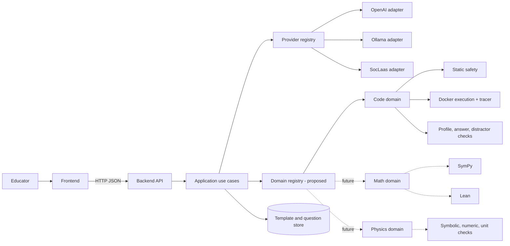
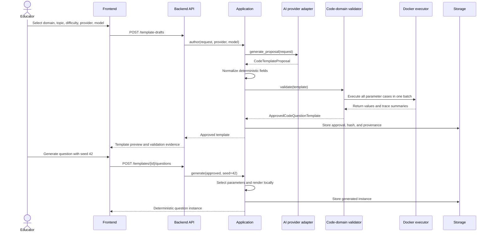
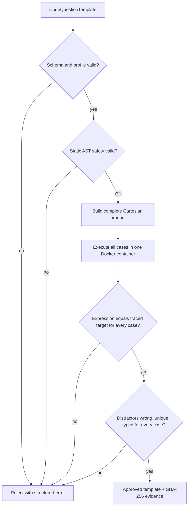
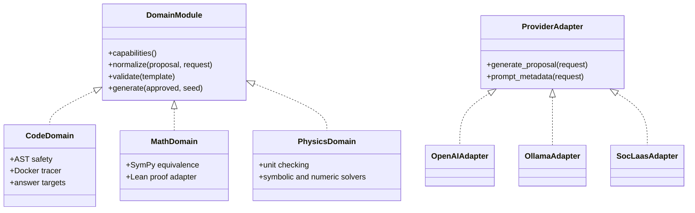

# EdCraft: Validated, Reusable Question Generation

## 1. Project summary

EdCraft is a question-generation platform in which an AI model authors a reusable
question template once, domain-specific tools validate it, and the approved
template generates many deterministic questions without further AI calls.

The first completed domain is Python code-tracing multiple-choice questions. A
future frontend will let an educator select a domain, topic, difficulty, provider,
and model; review the resulting template; and generate question instances from it.

The central design principle is:

> AI proposes; deterministic tools approve; approved templates generate.

This reduces API cost, prevents model confidence from being treated as proof of
correctness, and keeps model providers replaceable.

## 2. Problem and motivation

Generating every question directly with an AI model has three weaknesses:

- Every question requires another paid or time-consuming inference.
- Output quality varies between calls and models.
- Each generated question must be validated independently.

EdCraft moves the AI call earlier in the process. The model creates a parameterized
template, such as a function over `n` and `m` whose answer is `n + m`. The system
validates every allowed parameter combination once. Afterwards, a seed selects a
combination and renders a trusted question locally.

## 3. Objectives

1. Generate multiple reproducible questions from one AI-authored template.
2. Establish correctness with domain tools rather than model self-evaluation.
3. Complete the Python code domain before adding mathematics and physics.
4. Allow providers and models to be swapped without changing domain logic.
5. Preserve provenance, validation evidence, latency, and failure diagnostics.
6. Expose a stable application interface for a future frontend and backend API.

## 4. Scope and implementation status

### Implemented

- Explicit provider selection: OpenAI, Ollama, or SocLaas.
- Configurable model selection independent of provider selection.
- Provider-specific response handling normalized into one proposal contract.
- AI template authoring for five Python topics and three difficulties.
- Strict schemas for requests, proposals, templates, approvals, and questions.
- Static AST safety checks for generated Python.
- Exhaustive execution of up to 64 parameter combinations in one Docker batch.
- Validation of answers, topic/difficulty profiles, and distractor recipes.
- Deterministic, seeded question generation from approved templates.
- Template hashes and authoring provenance for reproducibility.
- JSONL evaluation of provider success rate, failures, and latency.
- Mocked provider tests, Docker integration tests, and opt-in live OpenAI tests.

The supported code topics are `arithmetic`, `conditionals`, `loops`, `functions`,
and `lists`. Each supports `beginner`, `intermediate`, and `advanced` profiles.
Parameters may be finite integers, booleans, printable strings, or integer lists.

### Proposed next stage

- Frontend for selecting generation constraints, reviewing templates, and creating
  question instances.
- A thin HTTP API over the existing application use cases.
- Persistent storage for template drafts, approved templates, and generated
  instances.
- Explicit human approval and template lifecycle states.
- Authentication, authorization, and usage controls.
- Additional domain modules, beginning only after the code workflow is stable.

## 5. Overall architecture



The provider boundary answers: “How is a model called?” The domain boundary
answers: “What constitutes a valid template?” These concerns remain separate.

## 6. End-to-end interaction



The current repository implements the flow from `Application` onward. The UI,
HTTP endpoints, and storage shown above are proposed integration components.

## 7. Interfaces and sample fields

### Step 1: frontend authoring selection

The educator selects the learning constraints. The frontend should send values,
not provider-specific prompts.

```json
{
  "domain": "code",
  "topic": "loops",
  "difficulty": "intermediate",
  "num_distractors": 3,
  "provider": "ollama",
  "model": "qwen2.5-coder:14b"
}
```

The existing code contract is `TemplateAuthoringRequest`, containing `topic`,
`difficulty`, and `num_distractors`, plus a separate `TemplateProviderSelection`.
`domain` belongs at the future API routing layer.

### Step 2: provider-neutral application call

```python
application.author(
    TemplateAuthoringRequest(
        topic="loops",
        difficulty="intermediate",
        num_distractors=3,
    ),
    provider="ollama",
    model="qwen2.5-coder:14b",
)
```

The provider registry creates the selected adapter. Adding another provider only
requires a class implementing `generate_proposal` and `prompt_metadata`, followed
by registry registration.

### Step 3: model-authored proposal

Only fields requiring generative judgement come from the model:

```json
{
  "code": "def accumulate(n, m):\n    total = 0\n    for i in range(n):\n        total += i\n    for j in range(m):\n        total += j\n    return total",
  "entry_function": "accumulate",
  "parameters": [
    {"name": "n", "kind": "integer", "values": [2, 3]},
    {"name": "m", "kind": "integer", "values": [3, 4]}
  ],
  "answer_expression": "n + m",
  "distractors": [
    {
      "expression": "n + m - 1",
      "reason_template": "Misses one iteration."
    },
    {
      "expression": "n + m + 1",
      "reason_template": "Counts one extra iteration."
    },
    {
      "expression": "n + m + 2",
      "reason_template": "Counts both final loop checks."
    }
  ]
}
```

OpenAI uses Structured Outputs. Ollama uses a simpler provider wire schema and
strict local parsing. Both produce the same `CodeTemplateProposal` locally.

### Step 4: normalized code template

The application derives identity and instructional fields mechanically:

```json
{
  "template_id": "loops.intermediate.a1b2c3d4e5f6",
  "version": 1,
  "topic": "loops",
  "difficulty": "intermediate",
  "code": "def accumulate(n, m): ...",
  "entry_function": "accumulate",
  "parameters": [
    {"name": "n", "kind": "integer", "values": [2, 3]},
    {"name": "m", "kind": "integer", "values": [3, 4]}
  ],
  "question_template": "How many total loop-body iterations occur when accumulate({n}, {m}) runs?",
  "answer_target": "loop_iterations",
  "answer_expression": "n + m",
  "distractors": ["...three deterministic recipes..."],
  "question_type": "mcq"
}
```

This separation keeps IDs, wording, answer targets, and question type consistent
between models.

### Step 5: validation tools and evidence



For the sample parameter domain, four cases are checked: `(2,3)`, `(2,4)`,
`(3,3)`, and `(3,4)`. A successful result has this shape:

```json
{
  "template": {"template_id": "loops.intermediate.a1b2c3d4e5f6"},
  "validation": {
    "cases_validated": 4,
    "template_sha256": "64-character-sha256-value"
  },
  "authoring": {
    "provider": "ollama",
    "model": "qwen2.5-coder:14b",
    "prompt": {
      "version": "code-template-v8",
      "sha256": "64-character-prompt-sha256-value"
    },
    "request": {
      "topic": "loops",
      "difficulty": "intermediate",
      "num_distractors": 3
    },
    "generation_duration_ms": 50057.0,
    "validation_duration_ms": 1500.0,
    "status": "approved"
  }
}
```

Real hash and timing values vary per authored template. Secrets are never stored.

### Step 6: deterministic question generation

After approval, the frontend supplies a seed. No model or Docker call is needed.

```json
{
  "template_id": "loops.intermediate.a1b2c3d4e5f6",
  "template_version": 1,
  "template_sha256": "64-character-sha256-value",
  "seed": 42,
  "parameters": {"n": 2, "m": 4},
  "question": {
    "code": "def accumulate(n, m): ...",
    "entry_function": "accumulate",
    "inputs": {"n": 2, "m": 4},
    "question": "How many total loop-body iterations occur when accumulate(2, 4) runs?",
    "proposed_answer": 6,
    "distractors": [5, 7, 8],
    "distractor_reasons": [
      "Misses one iteration.",
      "Counts one extra iteration.",
      "Counts both final loop checks."
    ],
    "answer_target": "loop_iterations",
    "question_type": "mcq"
  }
}
```

The same approved template and seed always produce the same output. The template
hash detects modification after approval.

## 8. Relevant implementation files

| File | Responsibility |
| --- | --- |
| `src/edcraft_validator/template.py` | CLI entry point for authoring, validating, generating, and evaluating templates. |
| `src/edcraft_validator/application/__init__.py` | Stable facade intended for CLI and future frontend/API callers. |
| `src/edcraft_validator/domains/code/application.py` | Coordinates authoring, normalization, approval, and deterministic generation. |
| `src/edcraft_validator/generation/models.py` | Provider selection, authoring request, prompt metadata, and provenance contracts. |
| `src/edcraft_validator/generation/base.py` | Provider-neutral generator protocol and generation error types. |
| `src/edcraft_validator/generation/registry.py` | Explicit provider lookup and extension point. |
| `src/edcraft_validator/generation/openai.py` | OpenAI and SocLaas provider adapters. |
| `src/edcraft_validator/generation/ollama.py` | Ollama adapter and local response normalization. |
| `src/edcraft_validator/domains/code/templates.py` | Template schemas, normalization, exhaustive approval, and seeded expansion. |
| `src/edcraft_validator/domains/code/capabilities.py` | Machine-readable rules for all topic/difficulty profiles. |
| `src/edcraft_validator/safety.py` | Static Python safety analysis. |
| `src/edcraft_validator/executor.py` | Isolated single and batched Docker execution. |
| `src/edcraft_validator/_worker.py` | In-container execution and tracing worker. |
| `src/edcraft_validator/domains/code/evaluation.py` | Live provider evaluation, pass rates, failure categories, and timing. |
| `src/edcraft_validator/domains/code/pipeline.py` | Standalone concrete-question validation retained for diagnostics. |
| `src/edcraft_validator/domains/code/tools.py` | Focused safety, execution, distractor, and wording tools for that diagnostic pipeline. |

## 9. Proposed frontend and backend responsibilities

### Frontend

- Fetch supported domains, topics, difficulties, providers, and models.
- Submit template-authoring requests and show progress.
- Display generated code, parameters, expressions, and validation evidence.
- Allow an educator to accept, reject, or regenerate a template.
- Generate and preview deterministic questions using seeds.
- Export selected questions to the eventual learning platform format.

The frontend should never call model providers directly or mark a template as
technically valid. It displays decisions made by the backend validation boundary.

### Backend API

A small API can map directly to existing use cases:

| Endpoint | Purpose | Existing core operation |
| --- | --- | --- |
| `GET /capabilities` | Populate frontend selections. | Code capability profiles and provider registry. |
| `POST /templates/author` | Author and technically approve a template. | `QuestionTemplateApplication.author`. |
| `POST /templates/validate` | Validate an imported or edited template. | `QuestionTemplateApplication.approve`. |
| `GET /templates/{id}` | Retrieve template and evidence. | Proposed persistence layer. |
| `POST /templates/{id}/questions` | Generate a seeded question instance. | `QuestionTemplateApplication.generate`. |
| `POST /templates/{id}/review` | Record human accept/reject decision. | Proposed lifecycle service. |

Authoring may take tens of seconds, particularly with a local model. Production
authoring should therefore become an asynchronous job: return a job ID, expose
status, and let the frontend poll or subscribe for completion.

## 10. Future domain architecture



`DomainModule` is a proposed interface and should only be introduced when the
second domain is being built. Until then, the current explicit code-domain class
is simpler and avoids premature abstraction.

Math and physics should own different proposal and approved-template schemas.
They should share orchestration concepts—author, validate, approve, generate—but
should not be forced into Python-specific fields such as `entry_function` or
`answer_target`.

## 11. Recommended delivery plan

### Phase 1: consolidate the code-domain milestone

- Continue provider/model evaluations over every supported profile.
- Record generation settings such as temperature in evaluation provenance.
- Improve local-model prompt compatibility without weakening validators.
- Define versioning and migration rules for approved templates.

### Phase 2: introduce the integration boundary

- Add a domain-aware application request containing `domain`.
- Add a thin HTTP API around existing use cases.
- Define storage records for drafts, technical approvals, human reviews, and
  generated instances.
- Run authoring and Docker approval as background jobs.

### Phase 3: build the educator frontend

- Build selection, progress, review, validation-evidence, and question-preview
  screens.
- Keep provider/model controls in an advanced section; educators primarily choose
  learning intent.
- Add explicit human acceptance after technical approval.

### Phase 4: add a second domain

- Start with a narrow mathematics template type that SymPy can fully validate.
- Extract a shared `DomainModule` interface based on both real implementations.
- Add Lean only for question families where formal proof adds material value.
- Add physics after establishing dimensional-analysis and numerical-tolerance
  policies.

## 12. Evaluation criteria

The project should be evaluated on:

- Template approval rate by provider, model, topic, and difficulty.
- False-approval rate, which should be zero for the advertised finite domain.
- Generation and validation latency.
- AI calls and cost per approved template and per generated question.
- Reproducibility from template hash and seed.
- Test coverage across contracts, adapters, safety, Docker, and complete profiles.
- Educator review acceptance rate and time-to-question once the frontend exists.

## 13. Risks and mitigations

| Risk | Mitigation |
| --- | --- |
| Local models produce malformed or unsuitable templates. | Strict parsing, profile contracts, structured failures, evaluation, and model replacement. |
| Executing generated code is unsafe. | AST allowlist plus isolated Docker with no network, resource limits, read-only filesystem, and timeouts. |
| Exhaustive validation grows too large. | Finite domains and a hard limit of 64 combinations; use domain-specific proof methods for future infinite domains. |
| Templates change after approval. | SHA-256 identity and validation evidence tied to the exact template. |
| Frontend couples to one provider or domain. | Capability discovery and application-level contracts; provider details remain behind adapters. |
| A technically valid question is pedagogically weak. | Future human review and later pedagogical-quality validators kept separate from correctness approval. |

## 14. Clarifications before frontend implementation

The current architecture is sufficient to continue code-domain work. These product
decisions should be made before implementing the frontend and persistence layer:

1. Is the first frontend for a single educator on one machine, or a multi-user web
   application? This determines authentication and storage design.
2. Should educators select the model directly, or should the system select a model
   from a provider while model choice remains an advanced option?
3. Does “human approval” approve the reusable template, individual generated
   questions, or both?
4. Where should approved questions be exported first: JSON, an LMS format such as
   QTI, or an existing EdCraft service contract?
5. Should template authoring run synchronously for the prototype, or should the
   first frontend already use background jobs for long Ollama generations?

