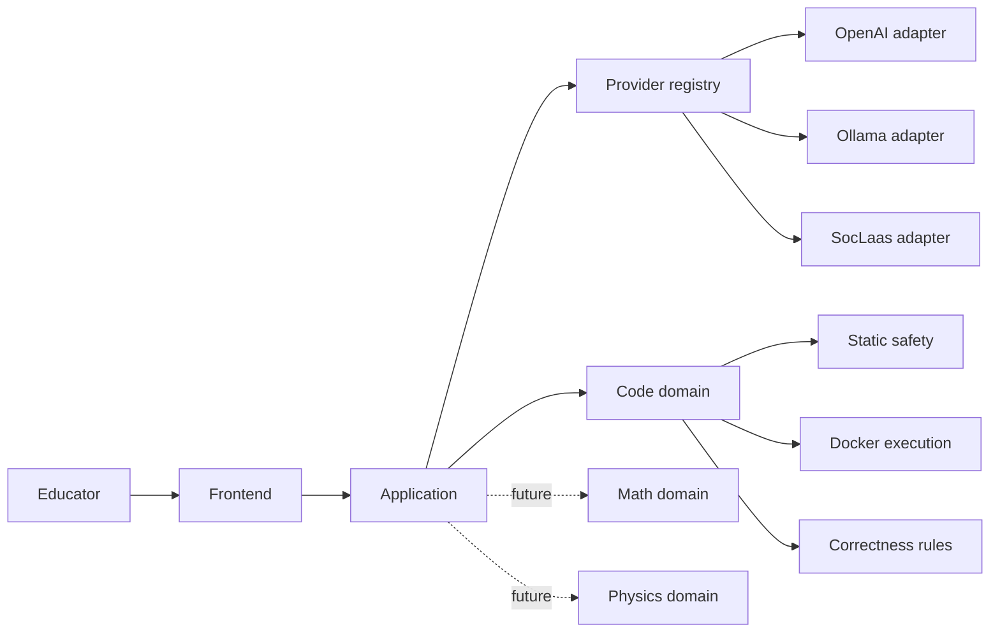
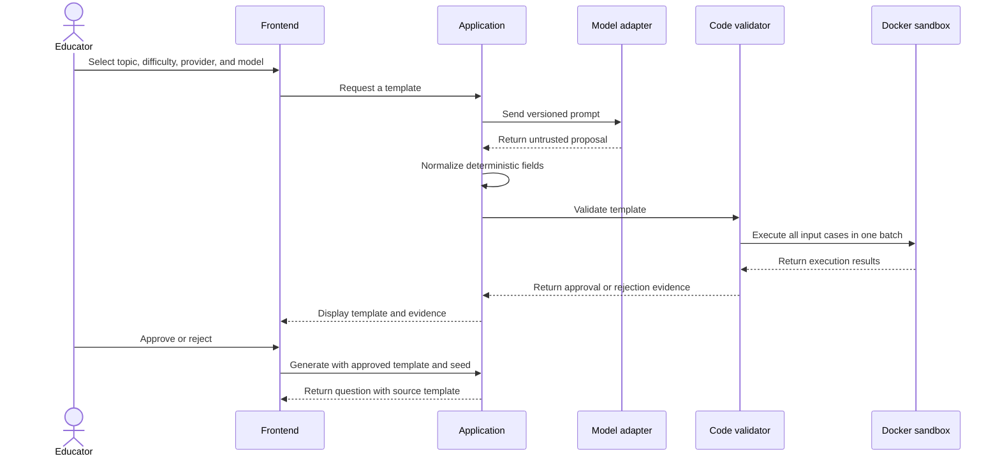

# EdCraft: Tool-Validated, Reusable Question Generation

## Initial project proposal

## 1. Summary

EdCraft explores a template-first approach to AI-assisted question generation. A
large language model (LLM) authors one parameterized question template,
domain-specific tools validate it, and the approved template generates many
questions locally without further LLM calls.

The initial prototype supports Python code-tracing multiple-choice questions. It
already provides model-provider selection, static safety checks, isolated Docker
execution, exhaustive validation over finite inputs, structured evidence, and
reproducible generation from a seed.

The core principle is:

> AI proposes; deterministic tools validate; educators decide; approved templates
> generate.

## 2. Motivation

Generating every question directly with an LLM is expensive and difficult to
trust: each question requires another inference, outputs vary between calls, and
every answer must be checked separately.

EdCraft asks the model to generate a reusable template instead. For example, a
loop question may use parameter `n` and define its answer as `n` loop-body
iterations. The system validates every allowed value of `n` once. Different
questions can then be produced by selecting parameter values deterministically.

This should reduce cost and latency while making correctness depend on explicit
tools rather than model confidence.

## 3. Research questions

1. How much cost and latency can reusable templates save compared with generating
   individual questions?
2. How much correctness assurance can deterministic validation provide over a
   template's declared parameter domain?
3. How reliably can different providers and models produce the same
   provider-neutral template contract?
4. Which quality dimensions—relevance, coverage, grounding, answerability,
   difficulty, Bloom's taxonomy, and redundancy—can be evaluated without using an
   LLM judge?
5. Can validation evidence help educators make reliable approve/reject decisions?

## 4. Objectives

- Generate many reproducible questions from one LLM-authored template.
- Validate correctness with domain tools.
- Keep model providers replaceable.
- Explain approval and rejection using versioned, structured evidence.
- Add source grounding and pedagogical-quality evaluation.
- Provide a simple educator review workflow.
- Extend the approach to mathematics and physics after completing the code domain.

## 5. Current prototype

The implemented code domain supports:

- Topics: arithmetic, conditionals, loops, functions, and lists.
- Difficulties: beginner, intermediate, and advanced for each topic.
- Providers: OpenAI, Ollama, and SocLaas, selected explicitly.
- Parameters: finite integers, booleans, strings, and integer lists.
- Static checking of a restricted Python subset.
- Exhaustive validation of at most 64 input combinations in one Docker batch.
- Answer, distractor, rendering, and topic/difficulty checks.
- Seeded local question generation without another LLM or Docker call.
- Template hashes, prompt/model provenance, timings, and validation evidence.
- Repeated live-provider evaluation with JSONL results.

The test baseline is 181 passing tests: 162 non-Docker tests and 19 Docker
integration tests. The live OpenAI test is opt-in.

## 6. Architecture



The current repository implements the application, provider adapters, and code
domain. The frontend and other domains are future work.

A provider adapter translates one external model API into EdCraft's local proposal
format. The registry selects an adapter by name. Domain validation remains
independent of the selected provider, so models can be changed without weakening
the correctness rules.

## 7. End-to-end workflow



Technical approval means the template passed the implemented safety and
correctness checks. Educator approval means a human considers it suitable for the
intended learners. The future frontend will use a direct approve/reject decision,
not a separate template-state system, and will keep the source template visible
while questions are generated.

## 8. Compact example

An educator begins with a request:

```json
{
  "topic": "loops",
  "difficulty": "beginner",
  "num_distractors": 3,
  "provider": "ollama",
  "model": "qwen2.5-coder:14b"
}
```

The model proposes code, finite parameters, an answer expression, and distractor
recipes. EdCraft derives fields such as the template ID, wording, answer target,
version, and question type.

```json
{
  "code": "def accumulate(n):\n    total = 0\n    for i in range(n):\n        total += i\n    return total",
  "parameters": [
    {"name": "n", "kind": "integer", "values": [2, 4, 5]}
  ],
  "answer_target": "loop_iterations",
  "answer_expression": "n",
  "question_template": "How many total loop-body iterations occur when accumulate({n}) runs?"
}
```

The validator checks all three parameter values. Its approved artifact records a
validator version, template hash, case count, and evidence for each check:

```json
{
  "validator_version": "code-template-validator-v1",
  "cases_validated": 3,
  "template_sha256": "75a9d79a03b9c1040745b672dbb7ae48eb9d0564ee3f412851e61fdd04cdee1a",
  "evidence": [
    {"check": "template_structure", "status": "passed", "assurance": "bounded"},
    {"check": "sandboxed_execution", "status": "passed", "assurance": "exhaustive"},
    {"check": "answer_consistency", "status": "passed", "assurance": "exhaustive"}
  ]
}
```

Seed `42` then produces a question locally:

```json
{
  "seed": 42,
  "parameters": {"n": 4},
  "question": "How many total loop-body iterations occur when accumulate(4) runs?",
  "answer": 4,
  "distractors": [3, 5, 6]
}
```

The same approved template and seed always produce the same output.

## 9. Validation and assurance

The code validator performs:

1. Schema and topic/difficulty profile validation.
2. Static AST safety checks.
3. Bounded evaluation of answer and distractor expressions.
4. Exhaustive Docker execution of the finite input domain.
5. Answer and trace comparison for every case.
6. Distractor uniqueness and correctness checks for every case.
7. Template rendering checks.

Evidence is labelled `proof`, `exhaustive`, `bounded`, `sampled`, or `heuristic`.
The current code workflow mainly uses exhaustive and bounded evidence.

An approved template passed the versioned checks for every declared input. This is
stronger than sampling, but it is not a formal proof about unrestricted Python or
the underlying interpreter and tracer.

## 10. Evaluation plan

The project will measure:

- Approval rate by provider, model, topic, and difficulty.
- Failure codes and generation/validation latency.
- LLM calls, validation cost, and amortized cost per generated question.
- Reproducibility from template hash and seed.
- Correct rejection of unsafe or inconsistent templates.
- Relevance, coverage, grounding, answerability, difficulty, and redundancy.
- Educator approval rate, review time, and rejection reasons.

Pedagogical evaluation will use deterministic rules, static features, source-span
checks, symbolic methods, and exact matching first. Embeddings may provide
heuristic relevance and redundancy signals. An LLM judge will be optional, clearly
labelled as heuristic, and unable to override a correctness or safety failure.

Preliminary Ollama evaluation with `qwen2.5-coder:14b` approved 10 of 15 profiles
(66.7%). Attempts took 26.2–63.8 seconds. Rejected outputs were caught by schema,
safety, answer-type, or answer-consistency checks.

## 11. Milestones

1. **Code template generation — complete.** Provider-neutral authoring, 15 code
   profiles, Docker validation, seeded generation, and structured evidence.
2. **Enhanced validation.** Add stronger deterministic checks for relevance,
   coverage, grounding, answerability, and redundancy.
3. **Difficulty, quality, and knowledge base.** Add measurable learning objectives,
   Bloom classification, document ingestion, retrieval, citations, and source
   hashes.
4. **Frontend.** Let educators select constraints, inspect templates and evidence,
   approve/reject, and generate questions while viewing the source template.
5. **Mathematics and physics.** Add separate domain modules using tools such as
   SymPy, Lean, numerical solvers, and dimensional analysis.
6. **Optional chemistry.** Add only if earlier milestones are on schedule.
7. **User acceptance testing.** Evaluate the workflow and refine it using observed
   failures and educator feedback.

## 12. Risks and mitigations

| Risk | Mitigation |
| --- | --- |
| Unsuitable model output | Strict parsing, deterministic rejection, and replaceable models |
| Unsafe generated code | Restricted AST and isolated Docker with resource limits |
| Too many parameter combinations | Finite domains, a 64-case cap, and batched execution |
| Correct but weak educational content | Separate quality evidence and educator approval |
| Misleading heuristic scores | Label uncertainty and never override deterministic failures |
| Unsafe uploaded documents | Treat retrieved text as untrusted and preserve source provenance |
| Premature abstraction | Extract shared domain interfaces only after implementing a second domain |

## 13. Expected deliverables

- A tested code-template generation and validation package.
- Reproducible provider/model evaluation results.
- Stronger correctness and pedagogical-quality evidence.
- A source-grounded knowledge-base workflow.
- A frontend prototype for review, approval, and question generation.
- A narrow non-code domain module if time permits.
- A final evaluation covering efficiency, correctness, quality, and limitations.

## 14. Relevant files

| File | Purpose |
| --- | --- |
| `src/edcraft_validator/domains/code/application.py` | Main code-template workflow |
| `src/edcraft_validator/domains/code/templates.py` | Contracts, prompting, validation, and generation |
| `src/edcraft_validator/domains/code/capabilities.py` | Topic and difficulty rules |
| `src/edcraft_validator/generation/registry.py` | Provider selection |
| `src/edcraft_validator/generation/openai.py` | OpenAI and SocLaas adapters |
| `src/edcraft_validator/generation/ollama.py` | Ollama adapter |
| `src/edcraft_validator/executor.py` | Batched Docker execution |
| `src/edcraft_validator/validation/contracts.py` | Structured validation evidence |

## 15. Questions for supervisor discussion

1. Should the main contribution emphasize validation assurance, cost reduction, or
   the complete educator workflow?
2. What size human-labelled dataset is feasible for calibrating quality measures?
3. Is a single-user local frontend sufficient for evaluation?
4. Is one mathematics module enough to demonstrate domain extensibility, or should
   physics also be required?
