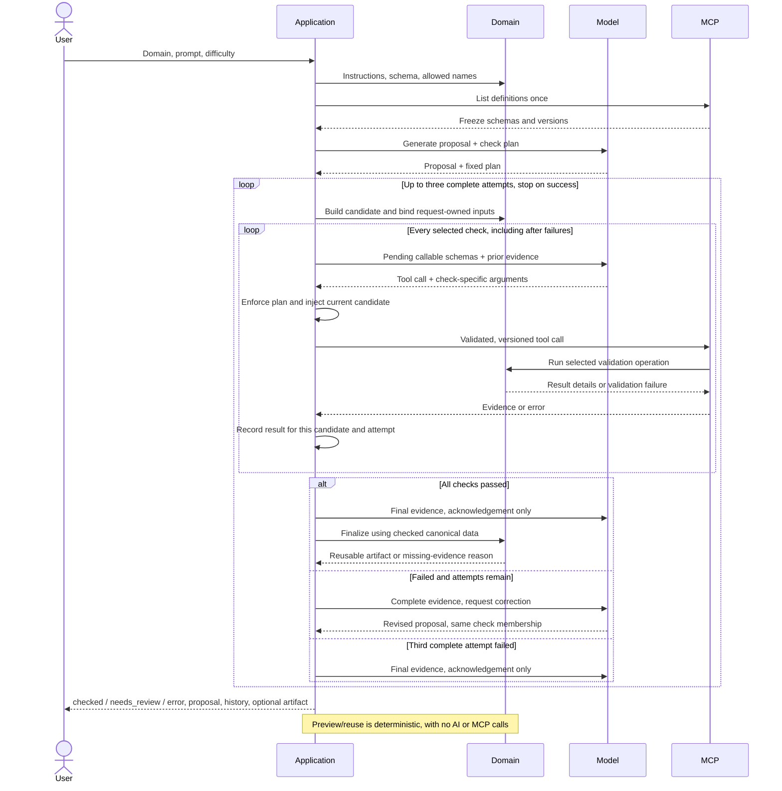

# Issue 38 implementation and verification

Implemented in `issue-38-architecture`, based on `f7f1b3f`, on 30 September 2026.
This report replaces the implementation recommendations in the historical
[architecture trace](issue-38-architecture.md). Approval and durable artifact version
binding are tracked separately in Issue 39.

## Current status: pipeline retired

The final Issue 38 implementation has one MCP checking boundary. Both `author` and
`validate` use model-selected checks; the application never inserts mandatory checks.
Approval and durable version binding remain explicitly outside this issue (#39).

| Area | Current behavior |
| --- | --- |
| `author` | Generate a proposal and fixed plan, then run up to three complete model/MCP correction attempts. |
| `validate` | Require a provider, ask the model for a plan for the exact supplied candidate, and run one complete MCP attempt without rewriting it. |
| Shared application code | Freeze the catalogue and candidate, enforce calls/bindings, record evidence, finish all selected checks, and invoke domain finalization. |
| Domain | Own validation operations and finalization requirements. A reusable code artifact still needs execution-derived canonical answers and checked distractors. |
| MCP | Expose tools and translate domain results/failures to timed, versioned evidence. |

Removed `validation/check_runner.py` and `domains/code/checks/check_wrapper.py`,
`ValidationPipeline`, `ValidationPlan`, `ValidationPolicy`, `ValidationReport`,
`ValidationCheck`, `CheckResult`, and the domain's `prepare_validation` /
`finalize_template` compatibility methods. `CodeDomain` no longer owns execution
dependencies; inject them into `create_validation_server` instead.

The automatic answer promotion and fallback-distractor implementations were also
removed. Low-level checks now populate their operation-local context or raise a
structured failure. Shared artifact evidence and domain failure contracts remain;
they do not execute checks or define a required-check policy.

Existing-candidate plans use `CheckPlanResponse` and `code-validation-v1`. The
schema accepts only a nonempty unique list of checks, not a rewritten proposal.
The candidate's identity and content remain in the result and provenance. In this
mode the code domain requires two distractors when two recipes are supplied, and
three when three or more are supplied. Both CLI paths return the result envelope:
exit 0 for `checked`, exit 2 for retained unsuccessful results, exit 1 for initial
input/configuration/planning errors. Extract `artifact` before deterministic reuse.

### Latest verification

- **312 passed, 1 opt-in live test skipped** in **12.48 seconds**.
- Pre-PR opt-in OpenAI authoring test: **1 passed, 312 deselected** in
  **36.03 seconds**, using the final implementation. All 313 collected tests passed
  across the ordinary and opt-in runs.
- Ruff lint, formatting (**90 Python files**), and `git diff --check` passed.
- Source/test search found no remaining references to the removed pipeline APIs.
- The earlier worker timer race did not recur in the two final full-suite runs.
  Earlier failures remain recorded below; the worker test was not weakened.

Pipeline-specific runner tests were removed with the runner. Evidence acceptance
coverage now targets MCP execution records. Existing domain tests were migrated to
operations, and old silent-repair tests now assert rejection without mutation.
All 15 repository example templates are checked through actual MCP clients/servers
with a scripted selector and real Python workers. New existing-candidate tests cover
exact candidate binding, no rewrites, model selection, omitted execution checks,
continuation after failure, invalid plans, and non-code domains. CLI tests cover the
new provider requirement and retained error/review results. Authoring correction,
provider, execution-safety, and deterministic-reuse coverage remains.

### Latest real-model checks

Actual OpenAI `gpt-5-mini` calls through the final `validate` CLI, MCP server and
Python worker; these are small smoke tests, not a provider-quality benchmark:

| Candidate | Model-selected checks (in order) | Result | Time |
| --- | --- | --- | ---: |
| Existing arithmetic example | Structure, answers/distractors | `checked`; 8 canonical cases | 12.859 s |
| Same candidate with `a + b + c` instead of `a + b - c` | Answers/distractors, structure | `needs_review`; answer mismatched in 8/8 cases, structure still ran and passed | 12.451 s |

Both runs used one complete attempt. The failing candidate was preserved exactly;
no answer was repaired and no artifact was produced. The successful artifact
reproduced the same seed-42 question twice: `calculate(4, 8, 1)` has answer **11**.
The CLI exited 0 and 2 respectively.

Full evidence is retained locally in the ignored `.artifacts` directory; these raw
files are not included in the PR. The summaries above and reproduction commands are
versioned. Local links: [valid candidate](../../.artifacts/issue-38-existing-valid-final.json),
[wrong-answer candidate](../../.artifacts/issue-38-existing-wrong-answer.json), and
[wrong-answer result](../../.artifacts/issue-38-existing-wrong-answer-final.json).
An earlier smoke run before the shared schema wording cleanup also accepted the
valid candidate and rejected the wrong answer; its files remain in `.artifacts`.

The sections below retain the original authoring implementation and verification
history. Their earlier test counts describe those earlier states, not the current
suite above.

## What changed

| Area | Change | Why |
| --- | --- | --- |
| `application/template_workflow.py` | Added `author_template()` and the bounded model/MCP loop. The old success-only entry point wraps it and raises an exception carrying the full unsuccessful result. | Execute the model's frozen plan; stop after success or three complete failures. |
| `application/authoring_contracts.py` | Added authoring results, attempt snapshots, correlated execution records, candidate digests and partial-error history. | A failed proposal remains inspectable; no cross-attempt evidence reuse. |
| `mcp/client.py` | Added one job-scoped in-process FastMCP client for listing and calling versioned tools. | The same authoritative server supplies definitions and executes checks. |
| Provider adapters and `llm_contracts.py` | Added native tool turns and correlated results for OpenAI-compatible endpoints and Ollama. OpenAI uses strict arguments when the projected schema already supports them. | Model requests become actual application-mediated calls; evidence returns to the model. |
| `domains/code/code_domain.py` | Added application-owned tool bindings and pure evidence-based finalization. | The model cannot substitute the candidate or lower the distractor count; finalization never re-executes the program. |
| `artifact_contracts.py` | Successful artifact provenance now includes all checking attempts. | Preserve the correction history, not only the final success. |
| CLI and evaluator | CLI returns the full result envelope; evaluator retains failed job history. | `needs_review` and incomplete errors are visible and machine-readable. |
| Prompt and documentation | Prompt version is `code-template-v13+response-v3`; removed automatic-repair promises and separated planning from execution instructions. Updated GOALS, README and sequence diagram. | Instructions match actual behavior. |
| Dependencies | Declared `jsonschema` directly; it was already transitively installed. | Validate against frozen MCP schemas without duplicating tool definitions. |

No new agent framework or independent correctness policy engine was introduced.
Existing deterministic code algorithms, worker restrictions, finite domains and
seeded question generation remain. Initially the manual `validate` command retained
the old pipeline; the current follow-up above removes it.

## Historical domain/MCP separation verification

The three operation bodies moved from `mcp/code_tools.py` into
`domains/code/validation_operations.py`:

| Domain operation | Responsibility |
| --- | --- |
| `verify_template_structure` | Sequence structure, expression, answer-domain and rendering checks; report case coverage and observed features. |
| `validate_answers_and_distractors` | Execute finite cases, compare proposed and actual answers, reject mismatches, select/check distractors, and return canonical answers and selected recipes. |
| `require_features` | Extract reachable features, compare them with requested features, and report missing features. |

The existing low-level check implementations remain in `domains/code/checks`.
`CodeDomain` retains candidate construction, application-owned bindings, finalization
requirements, and seeded expansion. MCP retains public names/descriptions/schemas/
versions, dependency injection, response deadlines, elapsed timing, error masking,
and conversion of domain results/failures to `ToolEvidence`. Domain operations do
not import MCP and are callable directly.

This is a behavior-preserving extraction. Check selection remains model-directed,
the plan remains frozen, and missing canonical evidence still returns `needs_review`
without a reusable artifact. Tool signatures, descriptions, versions, and evidence
payloads are unchanged. Existing live-call results below predate this extraction;
no new model calls were needed for it.

Follow-up verification:

- Focused domain-operation, MCP, authoring-loop, and catalogue tests: **55 passed**.
- Three new direct-domain tests cover real Python execution and isolated outputs,
  wrong-answer rejection without repair, and missing-feature diagnostics.
- AST comparison against the pre-extraction MCP file confirms all three operation
  bodies, public tool signatures, and registration metadata are unchanged.
- Full suite: **308 passed, 1 failed, 1 skipped** (5.58 seconds on the second run).
  Both full runs reproduced the previously documented worker timeout/trace-limit
  race in `test_reports_execution_timeout`; that test passed alone (0.06 seconds).
  It also reported a timer exception during AnyIO stream cleanup. The worker and
  that test were not changed by this extraction; the full suite is not green.
- Ruff lint, formatting (91 files), and `git diff --check`: passed.

The earlier test totals below describe the original implementation verification,
not this follow-up run.

## Execution rules

1. Resolve and freeze the domain's allowed MCP definitions once.
2. Generate a proposal and a nonempty, unique plan selected from that catalogue.
3. Freeze the candidate for the attempt. Remove application-owned arguments from
   callable schemas; reject attempts to override them and inject their true values.
4. Accept native calls only for pending names in the fixed plan. Validate arguments,
   execute through MCP, validate evidence and identity/version, record the result.
5. Continue after a failure until every selected name has a terminal result.
   Invalid arguments consume an unsuccessful slot without executing the tool.
6. If anything failed, allow proposal/argument correction and run the whole fixed
   plan again. Third complete failure returns `needs_review` with all history.
7. On success, code finalization consumes canonical answers and selected distractors
   from the semantic execution tool. Missing semantic evidence returns `needs_review`
   even if a structure-only plan passed; no answers are fabricated.

Malformed/incomplete conversations have a separate `2 * plan_size + 2` turn bound
per attempt and return `error` with pending names. Model and MCP calls retain their
configured deadlines. Final evidence is sent back to the model; an acknowledgement
failure is recorded separately and cannot erase completed checking evidence.

`checked` is technical success, not human approval. Durable approval/version binding
and the broader quality benchmark remain #39/#40 follow-ups.

## Final sequence



The corresponding editable [PlantUML source](generate-template.puml) is maintained
with the implementation. User approval is explicitly marked as future integration.

## Historical initial automated tests

Initial implementation ordinary suite: **306 passed, 1 opt-in live test skipped, 5.26 seconds**.
The existing opt-in live OpenAI regression was then run separately: **1 passed,
306 deselected, 46.62 seconds**. Across the two runs, all 307 collected tests passed.

```sh
RUN_OPENAI_LIVE_TESTS=1 uv run --env-file ../../ai/.env pytest -m openai_live -q
```

There are 32 new collected cases: 24 loop cases, six adapter cases and two CLI cases.
Existing workflow fixtures were migrated to exercise MCP rather than the old authoring
pipeline. Existing manual-validation and execution tests remain in place.

| Test group | Passing cases | What they establish |
| --- | ---: | --- |
| New authoring loop tests | 24 | Fail then correct; three failures; complete-plan execution after failure; candidate/count override rejection; unknown/unselected/duplicate calls; stale call IDs; changed plans; invalid arguments/evidence/version; missing tools; no cross-attempt pass mixing; missing canonical data; retained history on revision/acknowledgement failures. |
| Workflow, CLI, evaluator, catalogue and registries | 36 | Domain-independent authoring, actual non-code MCP tools, request/provider selection, catalogue snapshots, serialization, nonzero review/error exit codes and evaluator diagnostics. |
| OpenAI-compatible and Ollama adapters | 37 | Structured JSON/schema parsing, provider configuration, native call normalization, correlated result delivery, strict required arguments, timeouts and malformed responses. These are mocked adapter tests. |
| MCP server | 21 | Real in-process tool registration and invocation, structured evidence, isolated semantic execution, wrong-answer/distractor rejection, feature reachability and deadline/error handling. |
| Code algorithms, context and integration | 101 | Existing finite-domain templates, canonical answers, safe distractor selection, rendering, unchanged manual validation and deterministic expansion. |
| Request/proposal/question schemas and value comparison | 43 | Required difficulty/free-form prompts, typed finite values, unique parameters, malformed responses and type-aware answer/distractor comparison. |
| Python analysis, execution and worker | 31 | Supported syntax, worker protocol, execution deadlines, trace limits and failure reporting. |
| Legacy runner and validation contracts | 13 | Required evidence, fail-fast manual validation, incomplete/error results and policy acceptance. |

Commands:

```sh
.venv/bin/python -m pytest -q
.venv/bin/ruff check .
.venv/bin/ruff format --check .
uv lock --check --offline
git diff --check
```

Lint, formatting (89 Python files), lockfile and whitespace checks passed.
No type checker is configured in this repository.

One intermediate full-suite run hit an existing timing-sensitive worker test:
`test_reports_execution_timeout` observed the trace limit before its 10 ms alarm.
The assertion was not weakened or skipped. The isolated test and subsequent full
runs passed. This timing race is retained here rather than hidden by the final pass.

## Historical authoring model results

These are actual network calls to the configured OpenAI `gpt-5-mini` alias,
using the real in-process MCP server and local Python execution worker.
The alias was requested explicitly; these records do not pin an underlying dated
model snapshot. Prompt version: `code-template-v13+response-v3`. Each successful
artifact was expanded twice with seed 42 and produced identical questions.

| Final run | Complete attempts | Model calls (proposal/revision + tool turns) | Cases exhaustively checked in final artifact | Time | Result |
| --- | ---: | --- | ---: | ---: | --- |
| Beginner: add two integers | 1 | 1 + 4 | 9 | 37.093 s | checked |
| Intermediate: accumulate in a loop | 2 | 2 + 7 | 18 | 88.360 s | checked |
| Advanced: helper function inside a loop | 2 | 2 + 7 | 8 | 177.451 s | checked |
| Controlled off-by-one answer drill | 2 | 2 + 7 | 6 | 71.948 s | checked |

The final tool turn delivers evidence and requests acknowledgement; it does not run
another check. Every final natural run selected the same three available tool names.

What actually happened:

- Beginner passed directly. Seed 42 asks `add_two(3, 4)`, canonical answer `7`,
  distractors `[-1, 12, 8]`.
- Intermediate initially requested a conditional feature its code lacked. The model
  revised the code, and all three checks passed on the second attempt. Seed 42 asks
  `accumulate(3, -2, -1)`, canonical answer `-5`, distractors `[-2, -4, 1]`.
- Advanced initially failed `UNSUPPORTED_CODE` for its helper call. Revised code
  passed all three checks. Seed 42 asks `compute_total(2, 1, 3)`, canonical answer
  `4`, distractors `[5, 7, 2]`.
- The off-by-one drill generated a real proposal, then deliberately replaced only
  its first answer expression with `(original_expression) + 1`. MCP returned
  `PROPOSED_ANSWER_MISMATCH` for **6 of 6 cases**. The real model revised it to
  `a + b`; the full fixed plan passed. Seed 42 asks `add(3, 5)`, canonical answer
  `8`, distractors `[15, -2, 2]`. This is a controlled failure test, not a natural
  model-success-rate measurement. Model-selected feature arguments also changed;
  check-name membership remained fixed.

Full local evidence:

- [Final natural runs](../../.artifacts/issue-38-openai-final.jsonl)
- [Off-by-one mismatch drill](../../.artifacts/issue-38-openai-answer-mismatch.jsonl)
- [Earlier natural runs before the prompt/strict-argument fix](../../.artifacts/issue-38-openai-natural.jsonl)
- [Earlier expression-limit drill](../../.artifacts/issue-38-openai-correction.jsonl)

Earlier natural runs produced `needs_review`, `checked`, `needs_review`. The model
omitted required feature arguments or tried to resupply application-owned candidate
arguments. The application rejected those calls. That evidence led to clearer phase
instructions and strict OpenAI tool arguments; these failures remain in the records.
The earlier drill used the out-of-bounds constant `999999`, so it exercised expression
rejection rather than answer comparison; the off-by-one drill above specifically
verified execution-derived mismatch correction.

The Ollama server at localhost:11434 was unavailable (connection refused), so no
real Ollama success is claimed. SocLaas has adapter tests but was not live-tested.

## Practical limits and follow-ups

The live intermediate example added an always-true conditional to satisfy its own
selected feature requirement. The correction drill initially requested many
irrelevant features and later reduced its feature arguments. These are concrete
examples of why syntactic check success does not establish pedagogical quality or
check-selection quality. The workflow records these choices but intentionally
contains no separate rule engine for omitted or unnecessary checks.

Model selection is not a correctness verdict. A reusable code artifact requires
actual canonical-answer/distractor evidence, and all selected checks must pass for
one attempt's exact candidate. Those guarantees are bounded to the declared finite
input domain. Difficulty calibration, prompt relevance and human approval require
their separate planned work.

Both `author` and `validate` now output a result envelope. Consumers must extract
`artifact` before loading `ValidatedCodeTemplate` or calling `generate`. Deterministic
`generate` input is unchanged. `validate` additionally requires a model provider.

Implementation references for provider message formats:
[OpenAI function calling](https://developers.openai.com/api/docs/guides/function-calling)
and [Ollama tool calling](https://docs.ollama.com/capabilities/tool-calling).
